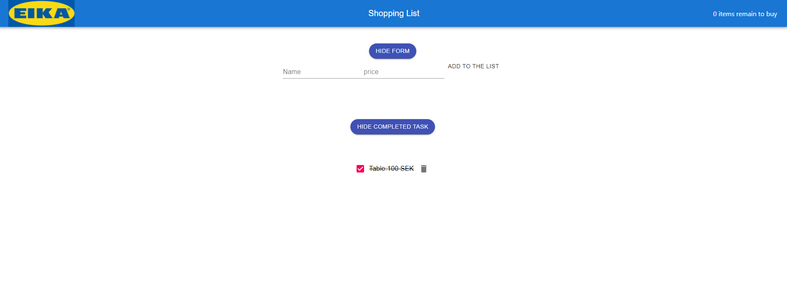
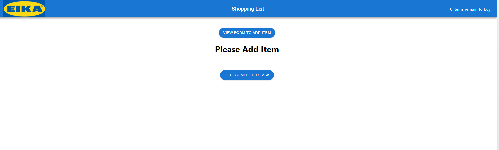

# Project name

An application used to create a shopping list and mark the items when it is complete and view the completed items.

## Available Scripts

In the project directory, you can run:

### `npm start`

Runs the app in the development mode.\
Open [http://localhost:3000](http://localhost:3000) to view it in your browser.

The page will reload when you make changes.\
You may also see any lint errors in the console.

### `npm run build`

Builds the app for production to the `build` folder.\
It correctly bundles React in production mode and optimizes the build for the best performance.

The build is minified and the filenames include the hashes.\
Your app is ready to be deployed!

See the section about [deployment](https://facebook.github.io/create-react-app/docs/deployment) for more information.

## Project status

Ready to use

### Project screen shots

### Technology used on this project

HTML, CSS, JavaScript, React functional components, React hooks (UseState and UseEffect) and Material UI.

### Reflection
This was a 2 week long project during my pre-course for Intensive Frontend course by  Novare Potential.
I have used Materials UI to get the pre-build Header, form and button elements. There are mainly five react functional components (App, Header, TodoForm, TodoList and Todo) in this project. Among them App is the main component and I have rendered other components like Header, TodoForm and TodoList inside App component. I have reused TodoList components twice to view the list items and completed list items. I have used the UseState hook to track the dynamics state of our App.  I have also used the useEffect hook to retrieve and store data from  local storage of the  browser

